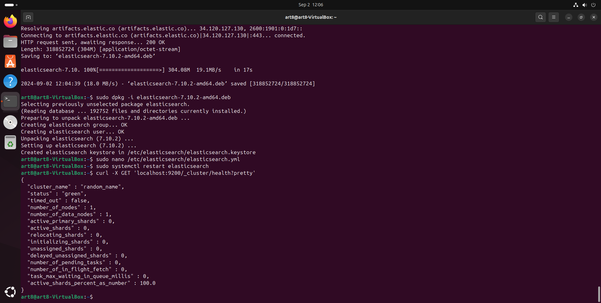
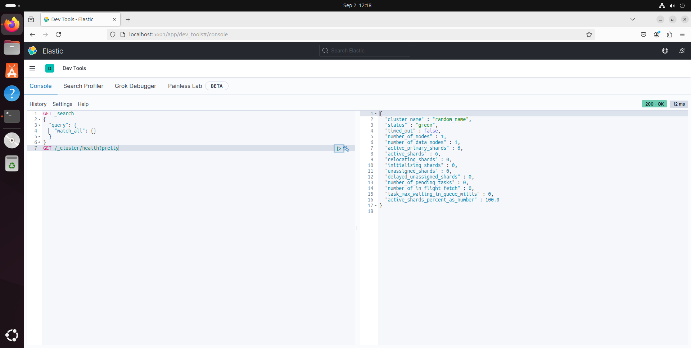
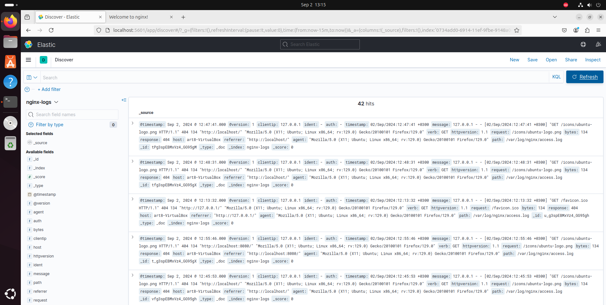
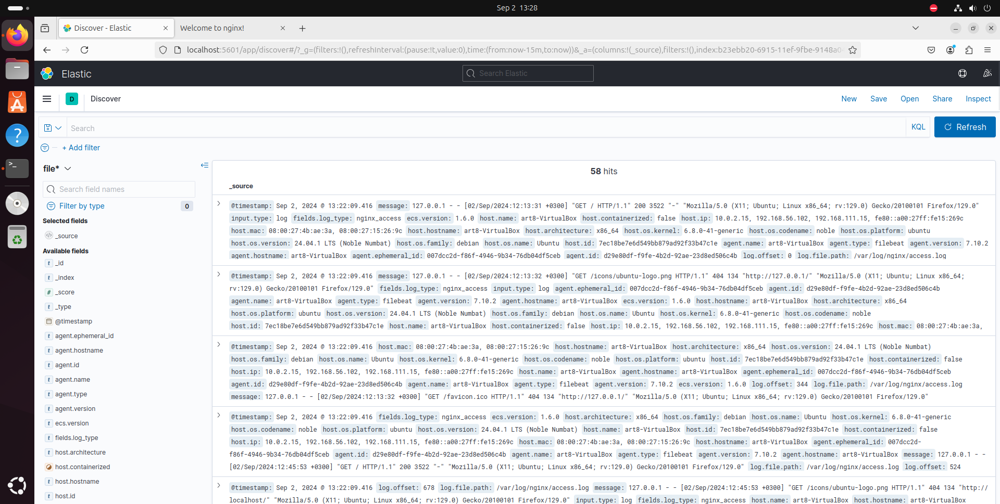

# Домашнее задание к занятию «ELK» Artem Zhdanov

## Задание 1: Скриншот рандомного имени кластера

## Задание 2: Скриншот интерфейса Kibana

## Задание 3: Скриншот интерфейса Kibana с логами Nginx

## Задание 4: Скриншот интерфейса Kibana с логами, отправленными через Filebeat

